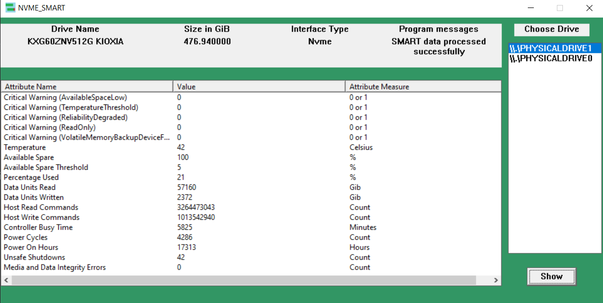

## NVME SMART registries application
Simple comprehensive tool for checking on SMART registries in NVME drives that doesn't require hex to decimal conversion or anything fancy

Uses: Win32 API and nvme.h

Built in: Visual Studio 2019

